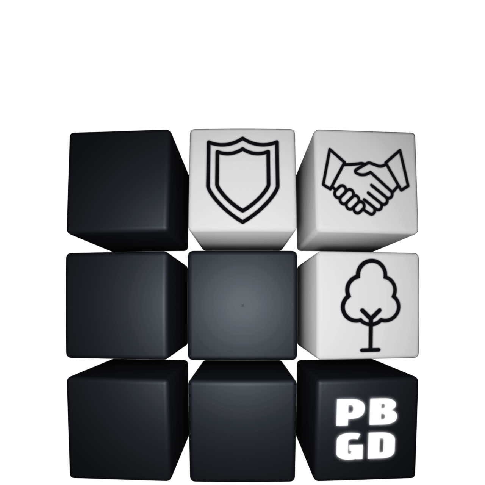

# 📘 Pinewood Builders Greywatch Division Handbook 

Welcome to the **Pinewood Builders Greywatch Division Handbook** — a community-created guide designed to support and inform members of the Greywatch Division group within the Pinewood Builders universe.

## ⚠️ Disclaimer
This handbook is an **unofficial, fan-made** resource. It is not affiliated with, endorsed by, or officially connected to Pinewood Builders, its developers, or any associated entities. All content within this guide is created by fans for fans, with the goal of enhancing the experience and understanding of the Neutrals role.

## 📖 What’s Inside
* Group values and motto
* Role expectations and conduct
* Tips for effective neutral play
* Community insights and strategies
* Visual references and terminology

## 🤝 Community Contribution
We welcome feedback and contributions from fellow fans. If you have suggestions, corrections, or ideas to improve the handbook, feel free to reach out through our Discord or community channels.
